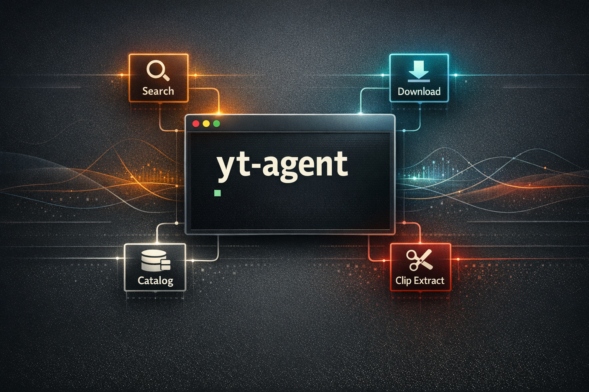
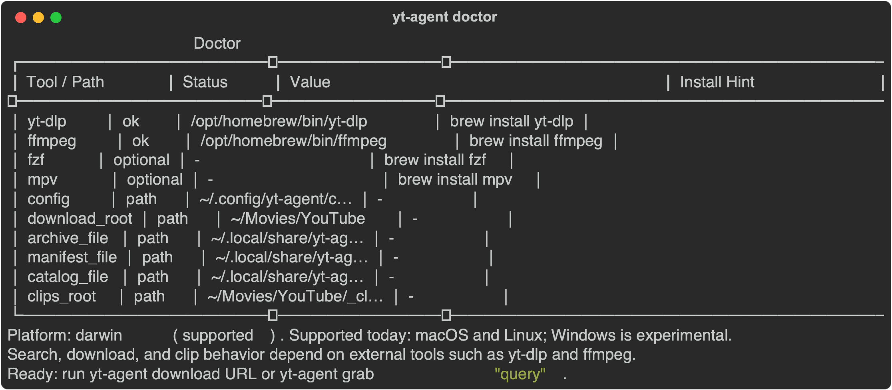
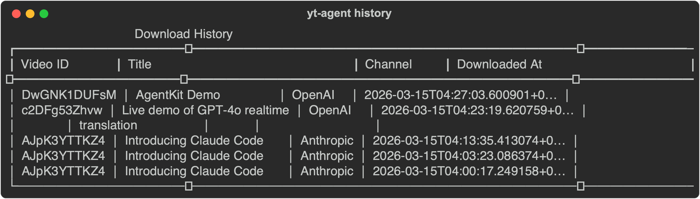
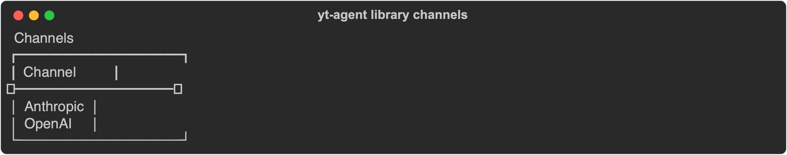
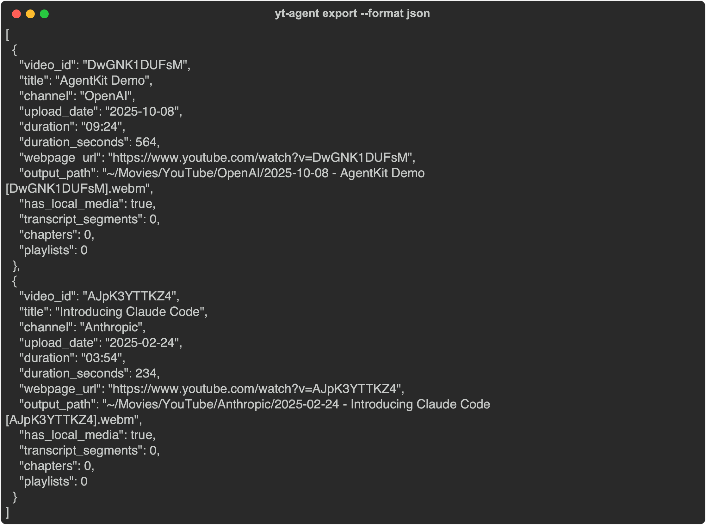
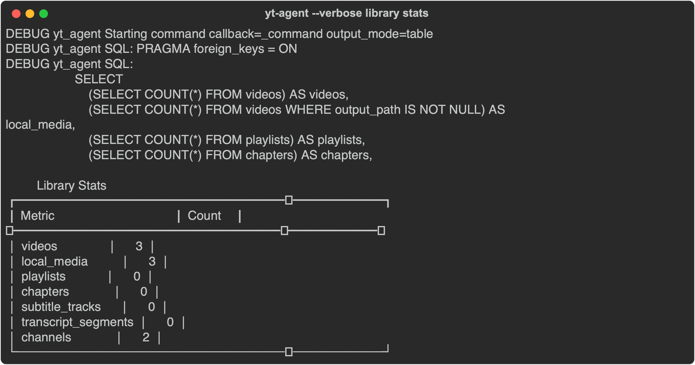
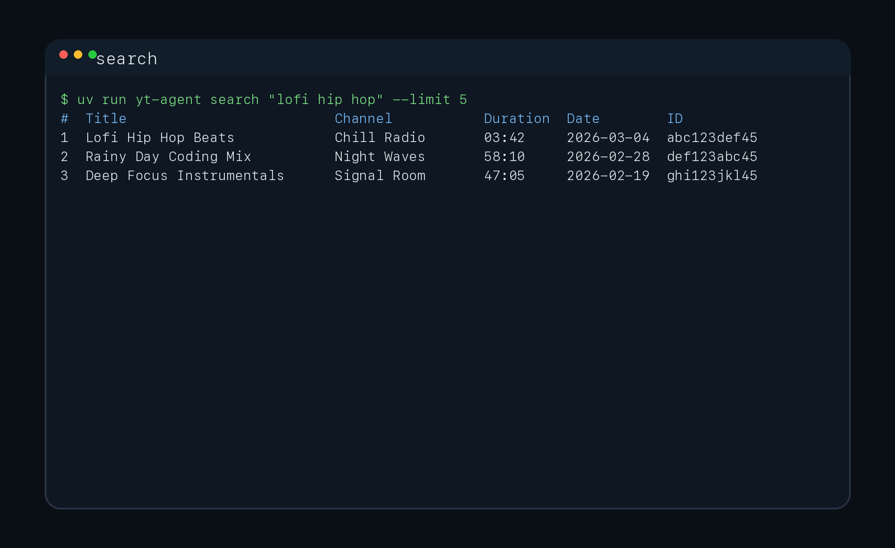
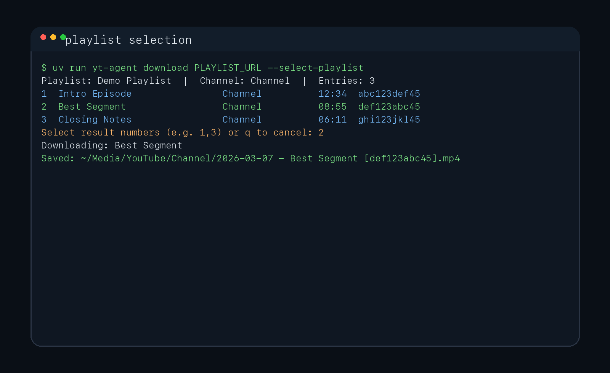
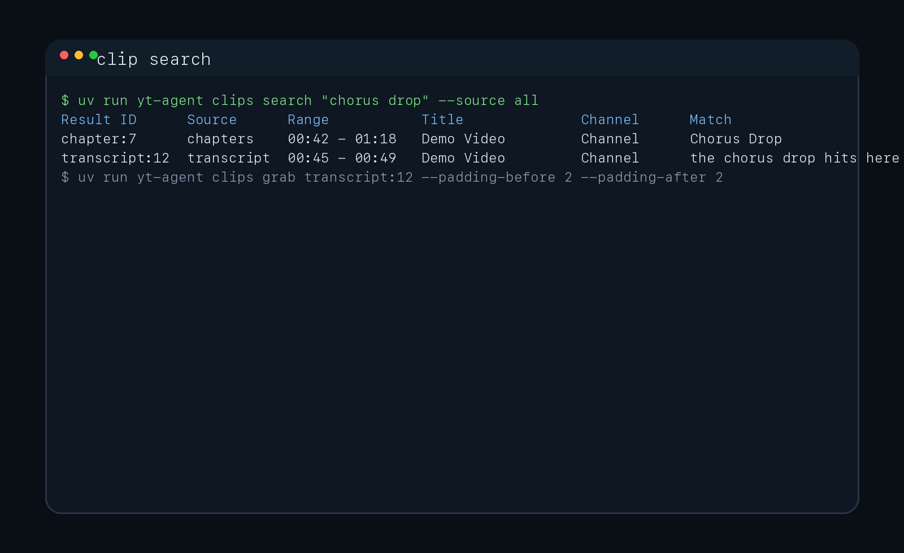
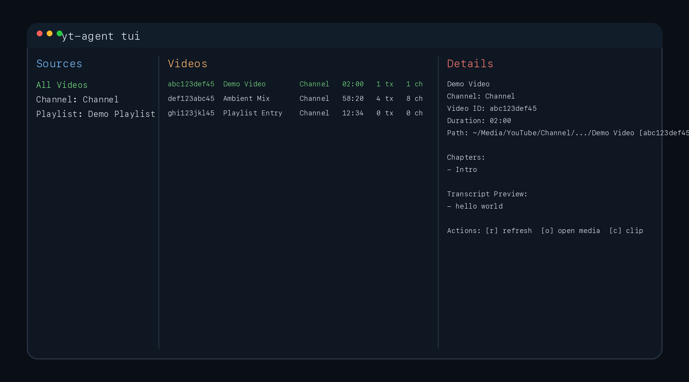

# yt-agent



Terminal-first YouTube download, catalog, and clip workflows for humans and coding agents.

`yt-agent` is built on `yt-dlp`, local sidecar files, SQLite FTS, and a small Textual catalog browser. It works well for direct human use and for coding agents that need structured, scriptable output.

## Quickstart

Install `yt-dlp` first. That is the only required runtime for basic search and download. Add `ffmpeg` later for clip extraction and `fzf` later for multi-select convenience.

```bash
# macOS
brew install yt-dlp
uv tool install git+https://github.com/jvogan/yt-agent
yt-agent doctor
```

```bash
# Linux
python3 -m pip install -U yt-dlp
uv tool install git+https://github.com/jvogan/yt-agent
yt-agent doctor
```

If you prefer `pipx`, use `pipx install git+https://github.com/jvogan/yt-agent` instead.

Optional follow-on tools:

```bash
# macOS
brew install ffmpeg fzf

# Linux
sudo apt-get install -y ffmpeg fzf
```

60-second success path:

```bash
yt-agent download "https://www.youtube.com/watch?v=dQw4w9WgXcQ"
```

If you want a starter config, the tool can write one:

```bash
yt-agent config init
yt-agent config path
```

More install detail lives in [docs/getting-started.md](docs/getting-started.md). Shell-specific completion notes live in [docs/shell-completion.md](docs/shell-completion.md).

## Docker

The repo ships with a multi-stage `Dockerfile` that builds a wheel with `uv build` and installs it into a `python:3.12-slim` runtime image with both `yt-dlp` and `ffmpeg` preinstalled.

```bash
docker build -t yt-agent .
docker run --rm -it yt-agent doctor
```

To use your local config or media directories, mount them into the container as needed:

```bash
docker run --rm -it \
  -v "$HOME/.config/yt-agent:/root/.config/yt-agent" \
  -v "$HOME/Media/YouTube:/root/Media/YouTube" \
  yt-agent download "https://www.youtube.com/watch?v=dQw4w9WgXcQ"
```

## Choose Your Path

- I already have a YouTube URL.
- I want to search or curate a playlist.
- I want to index a library and cut clips.
- I want to drive this from Codex, Claude Code, Gemini CLI, opencode, or antigraviti.

## Core Workflows

Full recipe guide: [docs/recipes.md](docs/recipes.md)

### Direct download

If you already know the URL or video ID, `download` is the fastest path:

```bash
yt-agent download "https://www.youtube.com/watch?v=dQw4w9WgXcQ"
```

Preview the exact target first without writing anything:

```bash
yt-agent download "https://www.youtube.com/watch?v=dQw4w9WgXcQ" --dry-run
```

### Search and curate

`grab` searches, shows results, prompts you to pick, and downloads:

```bash
yt-agent grab "lofi hip hop"
# shows numbered results, you type 1,3 to pick, downloads start
```

If you want to browse results first without downloading anything:

```bash
yt-agent search "lofi hip hop" --limit 5
# note the video ID from the results table, then:
yt-agent download abc123def45
```

For audio only (music, podcasts), add `--audio`:

```bash
yt-agent grab "podcast interview" --audio
```

### Curate a playlist

See what's in a YouTube playlist, then pick which entries to download:

```bash
yt-agent download "https://www.youtube.com/playlist?list=PL123" --select-playlist
# shows all entries, you pick interactively, only selected items download
```

Or preview the playlist first without downloading:

```bash
yt-agent info "https://www.youtube.com/playlist?list=PL123" --entries
```

### Find and extract clips

After downloading videos, index them into the local catalog so you can search transcripts and chapters. Then find specific moments and cut clips:

```bash
yt-agent index refresh --fetch-subs   # add --fetch-subs when transcript coverage matters
yt-agent clips search "chorus drop"
# shows matches with result IDs like transcript:12, chapter:3
yt-agent clips show transcript:12
# inspect the match in context before extracting
yt-agent clips grab transcript:12 --padding-before 2 --padding-after 2
```

`index refresh` is local-first by default. It replays the manifest and uses any sidecars already on disk. Add `--fetch-subs` when you want transcript coverage from the network. You can also fetch subtitles during download:

```bash
yt-agent download abc123def45 --fetch-subs
```

### Curate your library

```bash
yt-agent library stats
yt-agent library channels
yt-agent library playlists
yt-agent library list
yt-agent library search "ambient mix"
yt-agent library show abc123def45
yt-agent tui
```

## Screens

`yt-agent doctor` shows what tools are installed and where data lives:



`yt-agent history` shows recent downloads with channel and timestamp:



`yt-agent library channels` lists all channels in your local catalog:



`yt-agent export --format json` streams the full catalog as structured JSON:



`yt-agent cleanup --dry-run` previews what would be removed without touching files:


`yt-agent --verbose` surfaces debug-level SQL and lifecycle events:



`yt-agent search` prints normalized results in a clean table:



Playlist selection lets you pick specific entries before downloading:



`yt-agent clips search` finds moments across transcripts and chapters:



The TUI is a read-mostly catalog browser for exploring your indexed library:



## Commands

The compact command reference lives in [docs/command-reference.md](docs/command-reference.md).

Most read commands accept `--output table|json|plain`. Mutating commands also support `--output json`, `--dry-run`, and `--quiet`. Selection commands accept `--select 1,3` to skip interactive prompts.

## Agent-Friendly Surface

`yt-agent` is designed to work cleanly with coding agents and shell-driven automation:

- `--output json` on read and mutation commands for structured output
- JSON failures on `stderr` with `schema_version`, `status`, `exit_code`, `error_type`, `message`, and optional `stderr`
- `--select 1,3` to bypass interactive prompts
- `--dry-run` to preview mutations before approval
- `--quiet` to reduce chatter after approval
- `yt-agent doctor --output json` to diagnose missing tools (includes install hints per tool)
- Stable exit codes: 0 = ok, 3 = missing dependency, 4 = bad input, 5 = bad config, 6 = external failure, 7 = busy mutation lock, 8 = storage error, 130 = interrupted

Agent recipes, troubleshooting, and copy-paste prompts live in [docs/agent-workflows.md](docs/agent-workflows.md).

Two strong starting points:

- Approval-safe operator flow: [examples/agents/approval-safe-download.md](examples/agents/approval-safe-download.md)
- Library curator flow: [examples/agents/library-curator.md](examples/agents/library-curator.md)

## What Gets Stored Locally

| Path | Purpose |
|---|---|
| `~/.config/yt-agent/config.toml` | Configuration |
| `~/.local/share/yt-agent/archive.txt` | Duplicate-prevention archive |
| `~/.local/share/yt-agent/downloads.jsonl` | Append-only download manifest |
| `~/.local/share/yt-agent/catalog.sqlite` | Searchable catalog (FTS) |
| `~/Media/YouTube/` | Downloaded media |
| `~/Media/YouTube/_clips/` | Extracted clips |

Downloads are organized as `<channel>/<upload_date> - <title> [<video_id>].<ext>`.

More detail in [docs/concepts.md](docs/concepts.md).

## Support Matrix

| | Status |
|---|---|
| macOS | First-class |
| Linux | First-class |
| Windows | Experimental |
| `yt-dlp` | Required |
| `ffmpeg` | Required for local clip extraction |
| `fzf` | Optional, for terminal multi-select |
| `mpv` | Optional, reserved for future preview |

Full matrix: [docs/support-matrix.md](docs/support-matrix.md)

## Who This Is For

- People who already live in the terminal and want a reliable YouTube workflow
- Codex, Claude Code, Gemini CLI, opencode, antigraviti, and similar agents that need structured output and approval-safe mutations
- Users who want a local searchable catalog and transcript or chapter clip workflows

## Not For

- People who want a one-click desktop media manager with subscriptions, queues, and previews already built
- Generic arbitrary-site downloading; `yt-agent` is intentionally scoped to YouTube targets
- A zero-terminal consumer product

## Recipes and Examples

- Workflow guide: [docs/workflow.md](docs/workflow.md)
- Recipes overview: [docs/recipes.md](docs/recipes.md)
- Troubleshooting: [docs/troubleshooting.md](docs/troubleshooting.md)
- Command reference: [docs/command-reference.md](docs/command-reference.md)
- Batch download script: [examples/scripts/batch-download-from-file.sh](examples/scripts/batch-download-from-file.sh)
- Playlist preview script: [examples/scripts/playlist-curation-preview.sh](examples/scripts/playlist-curation-preview.sh)
- Remote index + clip script: [examples/scripts/remote-index-and-clip.sh](examples/scripts/remote-index-and-clip.sh)
- Library cleanup preview script: [examples/scripts/library-cleanup-preview.sh](examples/scripts/library-cleanup-preview.sh)
- Approval-safe download: [examples/agents/approval-safe-download.md](examples/agents/approval-safe-download.md)
- Playlist curator: [examples/agents/playlist-curator.md](examples/agents/playlist-curator.md)
- Clip hunter: [examples/agents/clip-hunter.md](examples/agents/clip-hunter.md)
- Library curator: [examples/agents/library-curator.md](examples/agents/library-curator.md)
- Codex prompt starter: [examples/agents/codex.md](examples/agents/codex.md)
- Claude Code prompt starter: [examples/agents/claude-code.md](examples/agents/claude-code.md)
- Gemini CLI prompt starter: [examples/agents/gemini-cli.md](examples/agents/gemini-cli.md)
- opencode prompt starter: [examples/agents/opencode.md](examples/agents/opencode.md)
- antigraviti prompt starter: [examples/agents/antigraviti.md](examples/agents/antigraviti.md)
- Skill pack: [skills/yt-agent/SKILL.md](skills/yt-agent/SKILL.md)

## Responsible Use

`yt-agent` is not affiliated with YouTube or Google. It accepts YouTube URLs and YouTube video IDs, not arbitrary web URLs. You are responsible for complying with platform terms, copyright, licenses, permissions, and local law when you search, download, index, or clip media. Do not commit cookies, exported browser sessions, downloaded media, or private caches to this repo.

## Docs

- [Getting Started](docs/getting-started.md)
- [Shell Completion](docs/shell-completion.md)
- [Concepts](docs/concepts.md)
- [Agent Workflows](docs/agent-workflows.md)
- [FAQ](docs/faq.md)
- [Recipes](docs/recipes.md)
- [Support Matrix](docs/support-matrix.md)
- [Troubleshooting](docs/troubleshooting.md)
- [Command Reference](docs/command-reference.md)
- [Architecture](docs/architecture.md)
- [Workflow](docs/workflow.md)
- [Roadmap](docs/roadmap.md)
- [Release Checklist](docs/release-checklist.md)

## Development

```bash
uv sync --dev
uv run ruff check .
uv run pytest
uv build
```

See [CONTRIBUTING.md](CONTRIBUTING.md) for contribution expectations and [THIRD_PARTY.md](THIRD_PARTY.md) for upstream acknowledgements.

---

`youtube-cli` is shipped as a transitional alias during the `0.2.x` release line and will be removed in a future minor release.
